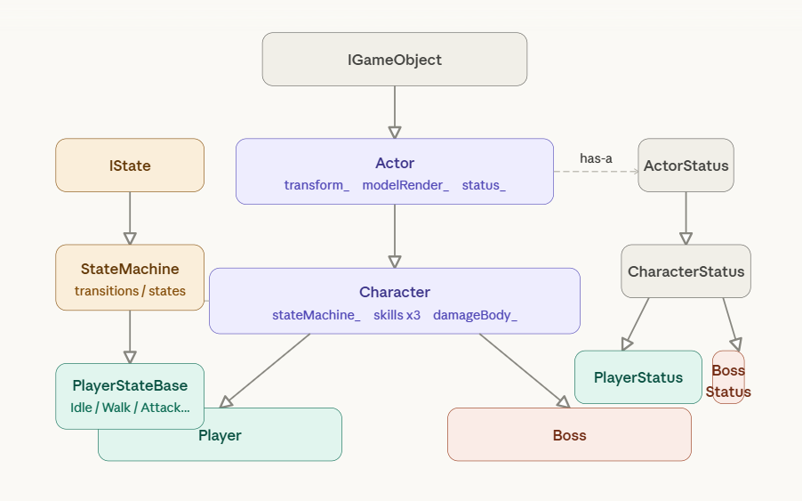
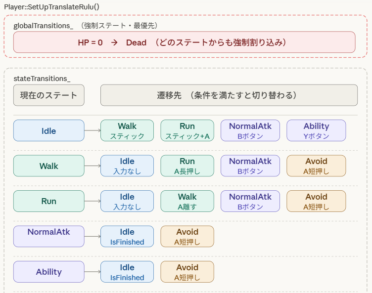
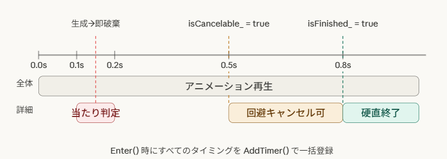
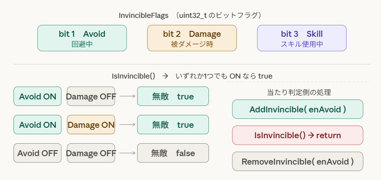
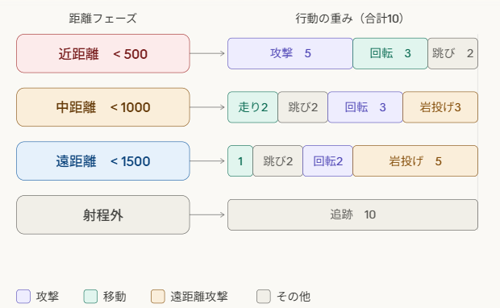
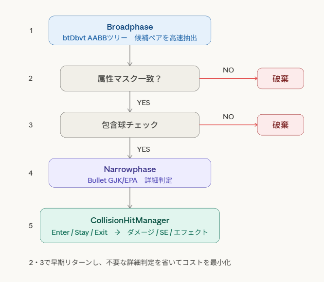
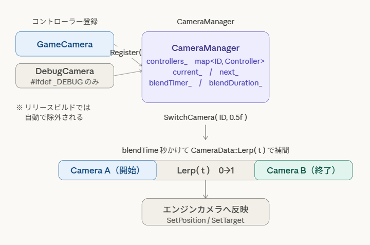

---

## 📋 目次

| No. | セクション |
|:---:|---|
| 1 | [👤 自己紹介](#1-自己紹介) |
| 2 | [📄 作品概要](#2-作品概要) |
| 3 | [🎮 ゲーム紹介](#3-ゲーム紹介) |
| 4 | [💻 担当コード](#4-担当コード) |
| 5 | [⚙️ 技術紹介](#5-技術紹介) |
| 6 | [🔧 今後の実装予定](#6-今後の実装予定) |

---

## 1. 自己紹介

<table>
  <tr>
    <td width="120px" align="center"><b>名前</b></td>
    <td>三好 爽太（みよし そうた）</td>
  </tr>
  <tr>
    <td align="center"><b>学校</b></td>
    <td>河原電子ビジネス専門学校　ゲームクリエイター科</td>
  </tr>
  <tr>
    <td align="center"><b>メール</b></td>
    <td><a href="mailto:CA01244028@st.kawahara.ac.jp">CA01244028@st.kawahara.ac.jp</a></td>
  </tr>
</table>

---

## 2. 作品概要

<table>
  <tr>
    <td width="140px" align="center"><b>タイトル</b></td>
    <td>がぶっとバスター</td>
  </tr>
  <tr>
    <td align="center"><b>ジャンル</b></td>
    <td>3D アクションゲーム</td>
  </tr>
  <tr>
    <td align="center"><b>制作人数</b></td>
    <td>3人</td>
  </tr>
  <tr>
    <td align="center"><b>制作期間</b></td>
    <td>2026年3月 〜 現在</td>
  </tr>
  <tr>
    <td align="center"><b>プレイ人数</b></td>
    <td>1人</td>
  </tr>
  <tr>
    <td align="center"><b>対応ハード</b></td>
    <td>PC（Windows 11）</td>
  </tr>
  <tr>
    <td align="center"><b>コントローラー</b></td>
    <td>Xbox 360 コントローラー</td>
  </tr>
</table>

 

### 🔗 リンク

| | |
|---|---|
| **GitHub** | [miyosisouta/ProjectGB](https://github.com/miyosisouta/ProjectGB.git) |
| **YouTube** | （動画投稿後に追記予定） |

 

### 🛠️ 使用ツール

| カテゴリ | ツール |
|---|---|
| エンジン | 学内エンジン（K2Engine） |
| エディタ | Visual Studio 2022 |
| 使用言語 | C++, HTML |
| 3D モデル | 3ds Max 2025 |
| エフェクト | Effekseer |
| 画像編集 | Adobe Photoshop |
| バージョン管理 | GitHub, Fork |

---

## 3. ゲーム紹介

### 🐲 ボス登場シーン

> このボスを倒すことがゲームの目標です。

---

### 🕹️ プレイヤーアクション

#### 通常攻撃

#### 特殊攻撃

#### 回避

> ダメージを受けるパターンと回避成功パターンの2種類を掲載しています。

| ダメージあり | 回避成功 |
|:---:|:---:|
 |  |

---

### 👾 ボスの攻撃パターン

#### 通常攻撃

#### 回転攻撃

#### ヒットスタンプ

---

### 🔊 音量設定

<!-- 💡 提案: 音量設定はゲーム紹介というよりUI紹介に近い内容です。
     「技術紹介」や独立した「UI紹介」セクションに移したほうが
     ゲームの流れを見せるゲーム紹介セクションがスッキリするかもしれません。
     現状はゲーム紹介の末尾に置いています。 -->

---

## 4. 担当コード

### 👤 プレイヤー
`Player` `PlayerState` `PlayerController`

### 👾 ボス
`BossCharacter` `BossState` `BossSpawner` `NPCController`

### 🏗️ 基底・共通
`Actor` `Character` `ActorStatus` `IState` `StateMachine` `CharacterDataBase`

### ⚔️ スキル
`ISkill` `NormalAttack` `AbilityBase` `DefaultAttack` `Utility`

### 💥 当たり判定
`GhostBody` `GhostBodyManager` `GhostPrimitive` `BroadphaseInterface` `BroadphaseImpl` `CollisionHitManager` `BoundingVolume` `PhysicalBody`

### 🎥 カメラ
`CameraCommon` `CameraController` `CameraManager` `CameraSteering`

---

## 5. 技術紹介

### ⚙️ 1. 階層型クラス設計

> 新キャラは継承するだけ

---

### ⚙️ 2. ステートマシン

> グローバル遷移で死亡を最優先

---

### ⚙️ 3. 攻撃タイムライン

> タイミングを秒数で一括管理

---

### ⚙️ 4. 無敵フラグ管理

> 複数の無敵要因を同時管理

---

### ⚙️ 5. 重み付き抽選AI

> 距離で行動パターンが変化

---

### ⚙️ 6. 当たり判定パイプライン

> 3段階で判定コストを最小化

---

### ⚙️ 7. カメラブレンドシステム

> 時間指定でなめらかに遷移

---

## 6. 今後の実装予定

- プレイヤーのスキルを2つ追加予定
- ボスを2種類追加、攻撃パターンをボス1体につき4種類作成

---

