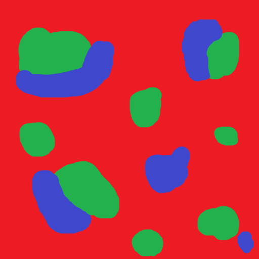
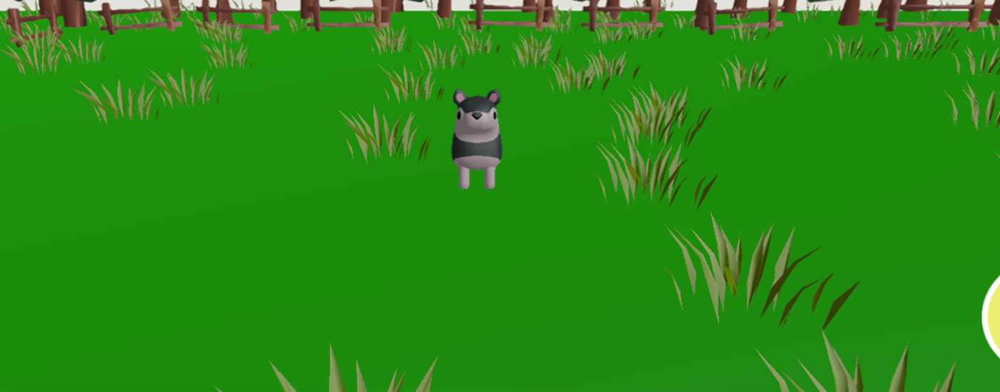
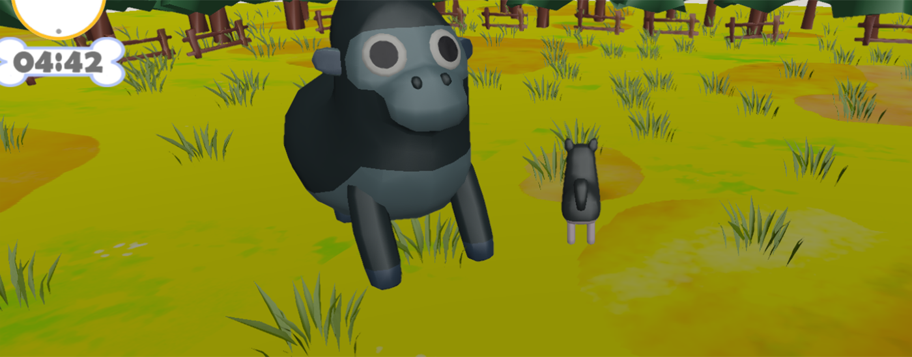
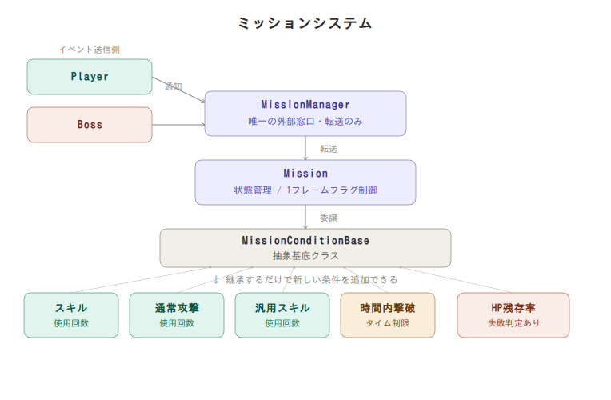
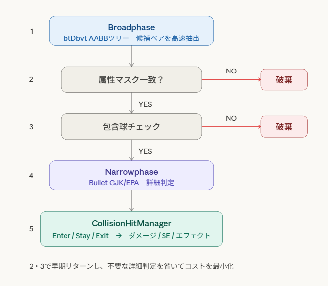
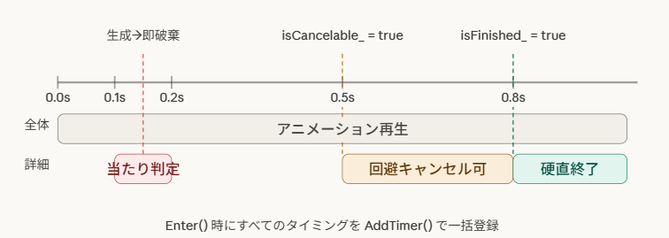
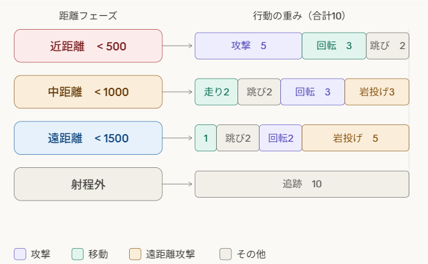
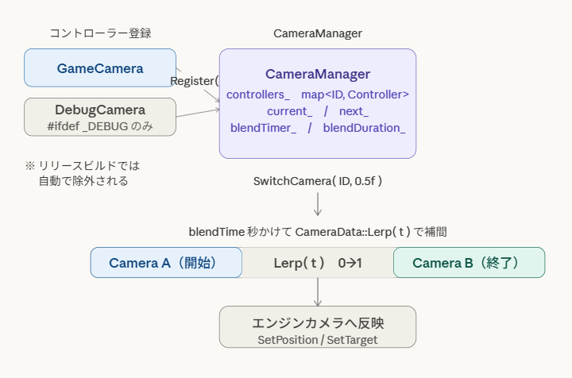

<link rel="stylesheet" href="style.css">

---

 

## 目次

| No. | セクション |
|:---:|---|
| 1 | [自己紹介](#1-自己紹介) |
| 2 | [作品概要](#2-作品概要) |
| 3 | [ゲーム紹介](#3-ゲーム紹介) |
| 4 | [担当コード](#4-担当コード) |
| 5 | [技術紹介](#5-技術紹介) |
| 6 | [今後の実装予定](#6-今後の実装予定) |

 

## 1. 自己紹介

<u><b>名前</b></u>  
　　　　三好 爽太（みよし そうた）  

<u><b>学校</b></u>  
　　　　河原電子ビジネス専門学校　ゲームクリエイター科  

<u><b>メール</b></u>   
　　　　<a href="mailto:CA01244028@st.kawahara.ac.jp">CA01244028@st.kawahara.ac.jp  </a>

 

## 2. 作品概要  

### 📝 基本情報 
| 項目 | 内容 |
| :--- | :--- |
| **タイトル** | がぶっとバスター |
| **ジャンル** | 3D アクションゲーム |
| **制作人数** | 2人 |
| **制作期間** | 2026年3月 〜 現在 |
| **プレイ人数**| 1人 |
| **対応ハード**| PC（Windows 11） |
| **コントローラー** | Xbox 360 コントローラー |

 

### 🔗 リンク

|　項目　| リンク |
|---|---|
| **GitHub** | [miyosisouta/ProjectGB](https://github.com/miyosisouta/ProjectGB.git) |
| **YouTube** | [がぶっとバスターPV](https://youtu.be/hErKex9rLmE)|

 

### 🛠️ 使用ツール

| カテゴリ | ツール |
|---|---|
| **エンジン** | 学内エンジン（K2Engine） |
| **エディタ** | Visual Studio 2026 |
| **使用言語** | C++, HTML |
| **3D モデル** | 3ds Max 2026 |
| **エフェクト** | Effekseer |
| **画像編集** | Adobe Photoshop |
| **バージョン管理** | GitHub, Fork |

 

## 3. ゲーム紹介

### 🦍 ボス登場シーン

> アウトゲームにて挑戦するボスを選択できます。  
> 選択したボスを倒すことがゲームの目標です。

---

### 🕹️ プレイヤーアクション

 
<u><b>通常スキル</b></u>
 

| 噛みつき |
|:---:|
 |

 
<u><b>特殊スキル</b></u>
 

| デフォルト攻撃 | 地雷 | 火魔法 |
|:---:|:---:|:---:|
 |  |  |

 
<u><b>汎用スキル</b></u>
 

> ダメージを受けるパターンと回避成功パターンの2種類を掲載しています。

| 回避（ダメージあり） | 回避（成功） |
|:---:|:---:|
 |  |

 

### 👾 ボスの攻撃パターン

| 通常攻撃 | 回転攻撃 | ヒットスタンプ |
|:---:|:---:|:---:|
 |  |  |

#### レーザー攻撃

| 通常 | 3連射 | チャージ |
|:---:|:---:|:---:|
 |  |  |

---

### ⚙️ 設定

| 🔊 音量設定 | 🎮 キーコンフィグ | 📷 カメラ設定 |
|:---:|:---:|:---:|
 |  |  |

 

## 4. 担当コード

### 👤 プレイヤー
`Player` `PlayerState` `PlayerController`

### 👾 ボス
`BossCharacter` `BossState` `BossSpawner` `NPCController`

### 🏗️ 基底・共通
`Actor` `Character` `ActorStatus` `IState` `StateMachine` `CharacterDataBase` `AttackObject` `AttackObjectManager`

### 🎯 バトル
`BattleManager` `Mission` `MissionCondition` `MissionEvent` `MissionManager` `MissionType`

### ⚔️ スキル
`ISkill` `NormalAttack` `AbilityBase` `DefaultAttack` `Utility` `Bomb` `Magic`

### 💥 当たり判定
`GhostBody` `GhostBodyManager` `GhostPrimitive` `BroadphaseInterface` `BroadphaseImpl` `CollisionHitManager` `BoundingVolume` `PhysicalBody`

### 🎥 カメラ
`CameraCommon` `CameraController` `CameraManager` `CameraSteering`

### 🏔️ ステージ
`StageBase` `StageManager` `StaticObject`

### 🌾 草システム
`GrassBendManager` `GrassObject` `grass.fx` `RenderToBufferFor3DModel.fx` `DitherCBData`

### 🧩 コアシステム
`KeyConfig` `ParameterManager`

### 🖥️ UI
`UIManager`

### 🐛 デバッグ
`DebugGrassScene`

 

## 5. 技術紹介

### 🌾 1. 草システム

 
<u><b>頂点シェーダーによるプロシージャルアニメーション</b></u>  
 

 

> - 地面が平らで何もないのが見た目的に寂しかったため、草を配置して自然なフィールドにしたいと思い実装しました。  
> - 時間経過で自然にもとに戻るようにしています。

  

 
<u><b>なぜ頂点シェーダーか</b></u>
 

> - インスタンシング描画と頂点シェーダーの相性がいいため。
> - LODやデータ管理が非常にシンプルで済むため
> - GPUの処理が比較的軽かったため
---

 
<u><b>LOD＋ディザリング＋インスタンシング</b></u>  
 

 

| 技術 | 採用理由 |
|:---|:---|
| LOD | 草のモデルが多くGPUの処理が重かったため、距離に応じてモデルを切り替えて負荷を下げた |
| ディザリング | LODでモデルを切り替えたときの境界が目立ったため、距離が遠いほどディザがかかるようにして切り替えを目立ちにくくした |
| インスタンシング | 300個以上の草をすべて個別に描画するとCPU側のドローコールが膨大になるため、一括描画で削減した |
| LOD ＋ ディザリング |LODでモデルを切り替えたときが目立ったので、カメラとの距離が遠いほど、ディザがかかるようにすることで目立ちづらくしました。|

 

| 近く | 遠い |
|:---:|:---:|
 |  |

 

<u><b>こだわった点</b></u>

> - 攻撃ごとの影響力、影響範囲などのパラメータをJSONで設定できるようにしました
> - 単発攻撃には `AddSource`、スピン攻撃など連続攻撃には `SetSource` とAPIを使い分けました

 

| 単発攻撃（AddSource） | スピン攻撃（SetSource） |
|:---:|:---:|
|  |  |

> - スピン攻撃用に固定スロット `SPIN_ATTACK_SLOT` を設けて他の攻撃と干渉しないようにしました
> - LOD0・LOD1のみ草曲げシェーダーを適用し、遠景のLOD2はデフォルトシェーダーで軽量化しました

---

### 🐛 2. 草用デバッグシーン

> 3dsMaxで1本ずつ手動配置するのは非効率で面白みがないため、ランダム生成とJSON書き出しができる専用シーンを作りました。  
> 納得いく配置が生成されたら JSON に書き出し、インゲームで読み込みます。

  
  <table>
    <tr><th>操作</th><th>内容</th></tr>
    <tr><td>F2</td><td>カメラを自由に操作</td></tr>
    <tr><td>J ボタン</td><td>草を再抽選して再配置</td></tr>
    <tr><td>K ボタン</td><td>現在の配置を JSON に書き出し</td></tr>
  </table>

 

<u><b>処理の流れ</b></u>

> 1. ステージに配置した2点の座標から草を生成する範囲を計算する
> 2. その範囲内でランダムに座標を生成する
> 3. AABBで既存の草と重なりチェックを行う
> 4. 重ならなければ配置、重なれば再抽選する（無限ループ防止のため上限100回）
> 5. 300個分繰り返す
> 6. 納得いく配置が生成されたらJSONに書き出す
> 7. インゲームでJSONを読み込んで草を配置する

 
<u><b>こだわった点</b></u>
 

> - AABBを使った重なり判定で草同士が重ならないように配置しました
> - エリアが狭い場合の無限ループを防ぐため、再抽選の上限を設けました
> - 草を消してから生成し直すまでに猶予時間を持たせ、見た目が不自然にならないようにしました

---

### 🎨 3. テクスチャブレンド（スプラットマップ）

> 草を実装した結果、地面が単色のままでは浮いて見えたため、複数テクスチャをブレンドして自然な地面にしました。  
> スプラットマップはペイントソフトで手書きし、明るさや彩度もパラメータで調整できるようにしました。

| チャンネル | テクスチャ |
|:---:|:---:|
| R（赤） | 草 |
| G（緑） | 岩土 |
| B（青） | 腐葉土 |

  

    
<b>スプラットマップ</b>

    
  

  

    
<b>適用前後</b>

    
    
▲ 適用前

     
    
    
▲ 適用後

  

 

<u><b>処理の流れ</b></u>

> 1. ペイントソフトでRGBスプラットマップを手書きする（R=草・G=岩土・B=腐葉土）
> 2. `SetupSplatShader()` でスプラットマップと3種類のテクスチャをシェーダーに渡す
> 3. シェーダー側でスプラットマップのピクセルのRGB値を読み取る
> 4. RGB値の割合に応じて3種類のテクスチャをブレンドして描画する
> 5. 明るさ・彩度パラメータで色味を調整する

 
<u><b>こだわった点</b></u>
 

> - `SetupSplatShader()` を `Init()` より前に呼ぶ設計にして、シェーダーのセットアップ順序を保証しました
> - 草・岩土・腐葉土の明るさと全体の彩度を個別にパラメータで調整できるようにしました

 

---

### 🔴 4. 攻撃予測インジケーターシステム

> エフェクトで円形を表現しようとすると引き延ばして使うことになり形が崩れてしまったため、専用のメッシュとシェーダーで実装しました。  
> またプレイヤーの攻撃かボスの攻撃か、自分が攻撃を受けるかどうかを見分けられるようにしたかったため実装しました。

| Circle | Line |
|:---:|:---:|
 |  |

 

<u><b>処理の流れ</b></u>

> 1. 攻撃ステートの `Enter()` で種類（Circle / Line / Box）・座標・サイズ・速度などのパラメータを設定して `AttackRange` を生成する
> 2. 生成時の `Start()` でメッシュとテクスチャを読み込み、種類に応じたシェーダーをセットして初期トランスフォームをモデルに反映する
> 3. 毎フレームの `Update()` でシェーダーパラメータを更新し、Circle はパルスリング拡大・Line は描画進捗・Box はタイリング値をそれぞれ計算して渡す
> 4. 攻撃予測フェーズが終わるタイミングでタスクラムダから `SetDraw(false)` または `DeleteGO` を呼んで非表示・削除する
> 5. 攻撃ステートの `Exit()` で `DeleteGO` を呼び、ステート中断時でもメモリリークが起きないよう確実に破棄する

 

<u><b>実装した内容</b></u>

| 種類 | 内容 |
|:---|:---|
| Circle | 中心から外縁へ向かうパルスリングアニメーション（攻撃タイミングに同期して正確に外縁到達） |
| Line | ボスから対象方向へ徐々に伸びる描画進捗アニメーション（clip命令で先端をリアルタイム制御） |
| Box | 9スライス UV タイリング（サイズが変わってもテクスチャが崩れない） |

 

<u><b>こだわった点</b></u>
 

> - Circle はパルスリングアニメーションを加えることで、攻撃タイミングが視覚的にわかりやすくなるようにしました
> - Circle・Line・Box の3種類を用意することで、どのような攻撃形状にも対応できるようにしました
> - Line はただ瞬時に表示するのではなく、描画アニメーションを加えて視覚的な面白さを持たせました
> - 攻撃の予測時間に合わせて `pulseSpeed` を計算し、リングが攻撃発動タイミングで正確に外縁到達するよう同期しました

 

---

### 🎯 5. ミッションシステム

> ただ攻撃してボスを倒すだけでは単調なため、プレイヤーに目標を与えるミッションシステムを実装しました。  
> 新しいミッションを追加するときも、既存のコードを一切触らずに完結します。

 

<u><b>処理の流れ</b></u>

> 1. ボスの種類に応じて `MissionManager::InitByBossType()` でミッションを初期化する
> 2. プレイヤーやボスのアクションが発生したら `MissionManager::Notify〇〇()` でイベントを通知する
> 3. `MissionManager` が各 `Mission` にイベントを転送する
> 4. `Mission` が `MissionConditionBase` に条件チェックを委譲する
> 5. 条件を満たしたら1フレームだけ判定を行う用のフラグを立てて状態を `Cleared` に遷移させる
> 6. UIがフラグを読み取ってクリア演出を再生する

 

<u><b>新ミッション追加手順</b></u>

> 1. `MissionType.h` の `MissionID` に新しいIDを1行追加
> 2. `MissionManager` の `SetupBoss()` に `AddMission` を1行追加
> 3. `MissionCondition.h` に条件クラスを追加（条件が新しい場合のみ）

 
<u><b>こだわった点</b></u>
 

> - `MissionEventData` を使った疎結合設計で、Player・Boss はミッションの内部を知らなくていい作りにしました
> - `clearedThisFrame_` などの1フレーム限りフラグを丁寧に管理し、UIとのタイミングのずれが起きないようにしました

 

---

### 💥 6. 当たり判定パイプライン

> 攻撃の対象を柔軟に設定できるようにしたかったため、3段階で判定コストを最小化する仕組みを実装しました。

 

<u><b>処理の流れ</b></u>

> 1. Broadphase（広域判定）でBVH（2分木）を使って衝突候補のペアを絞り込む
> 2. オブジェクト1つ1つを球で包み、球同士が当たらなければ判定を弾く
> 3. 2でかなり候補を絞った上で、形状ごとに正確な衝突判定を行う
> 4. 衝突ペアを `CollisionHitManager` に登録する
> 5. 状態ごとの処理がやりやすいよう `Enter`・`Stay`・`Exit` の3段階に分ける
> 6. 状態に応じてダメージ処理や演出を実行する

 
<u><b>こだわった点</b></u>
 

> - ビットマスクで攻撃属性と被弾属性を管理し、「誰の攻撃が誰に当たるか」を柔軟に設定できるようにしました
> - 形状タイプをID順に並べ替えることで、`Sphere vs Box` と `Box vs Sphere` の重複実装をなくしました
> - `Enter`・`Stay`・`Exit` の3状態管理で、ダメージ処理を一度だけ・継続・離脱時に実行できるようにしました

 

---

### ⚙️ 7. 攻撃タイムライン

> 攻撃ごとに毎回時間計算をUpdateに書くのが大変だったため、タイミングを秒数で一括管理できる `TaskSchedulerSystem` を利用して演出を実装しました。

 

<u><b>活用した内容</b></u>

> - ヒットスタンプ攻撃では「準備 → 上昇 → 空中待機 → 急降下 → 着地」の各フェーズの切り替えタイミングを秒数で管理しました
> - レーザー攻撃では「予測 → 発射 → 連射」の間隔をタイマーで制御し、攻撃パターンごとに時間を変えています

 

---

### ⚙️ 8. 重み付き抽選AI

> ただ攻撃してくるだけでは単調なため、距離別に攻撃の発動率を設定して行動パターンに変化を持たせました。

 

<u><b>処理の流れ</b></u>

> 1. プレイヤーとの距離を計算し、近距離・中距離・遠距離・射程外の4段階に分類する
> 2. 距離に対応した攻撃パターンリストを取得する
> 3. 0〜9の乱数を生成し、各攻撃の重みを累積して比較する
> 4. 乱数が累積値を下回った時点でその攻撃に決定し、ボスのステートを切り替える
> 5. ステートが終わったら待機（Idle）を挟んで次の行動を選び直す

 

<u><b>この設計で生じるメリット</b></u>

> - 距離によって行動パターンが変化するため、プレイヤーが一定の位置にいると単調にならない
> - 重みの数値を変えるだけで攻撃頻度を調整できるため、バランス調整が容易
> - 新しいボスを追加する際は攻撃ルールを1つ追加するだけで対応できる
> - ボス本体のコードを一切変えずにAIの行動パターンを変更できる

 

---

### ⚙️ 9. カメラブレンドシステム

> ボス登場シーンからゲームプレイへ切り替わる際にカメラが瞬間移動すると違和感があるため、時間を指定してなめらかに遷移できるようにしました。

 

<u><b>処理の流れ</b></u>

> 1. `SwitchCamera()` でカメラの切り替えを要求し、ブレンド時間を指定する
> 2. ブレンド開始時点のカメラ位置・ターゲット・視野角を保存する
> 3. 毎フレーム経過時間をブレンド時間で割り、0〜1の補間値を計算する
> 4. `CameraData::Lerp()` で現在のカメラと切り替え先のカメラを線形補間する
> 5. 補間値が1.0に達したら切り替え完了とし、新しいカメラをアクティブにする

 

<u><b>この設計で生じるメリット</b></u>

> - ブレンド時間を引数で指定するだけでどのカメラ切り替えにも対応できる
> - `ICameraController` インターフェースを挟んでいるため、新しいカメラを追加しても既存コードを変更しなくていい
> - 位置・ターゲット・視野角をすべて補間しているため、どんな角度からの切り替えでも自然に見える

 

## 6. 今後の実装予定

- 非同期にする
- 敵のAIの強化
- 感情システム（ボスとの駆け引きをさらに面白くする中核要素として実装中）

---

[目次へ戻る](#目次)